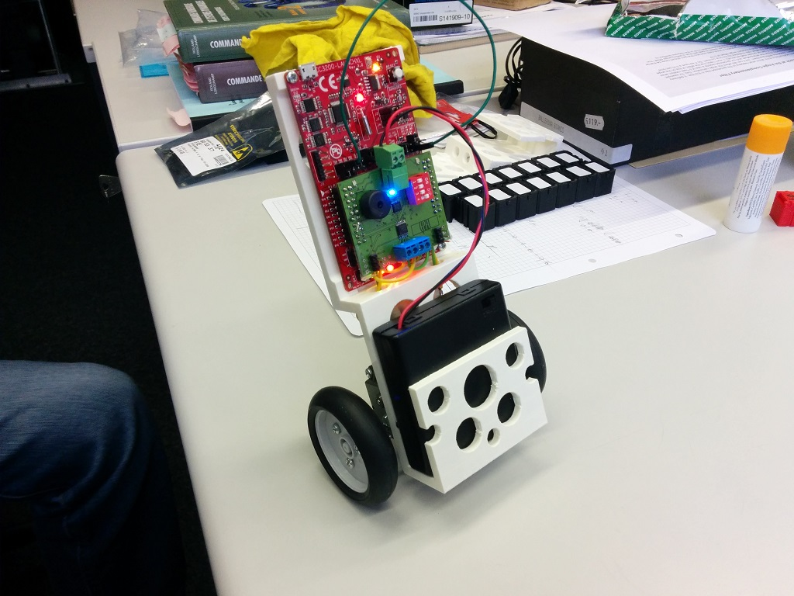

# PIDPOD

The PIDPOD is a small self-balancing gyropod platform based on the Texas Instruments [CC3200 development board](http://www.ti.com/tool/cc3200-launchxl), a custom booster pack with additional electronics such as an inertial measurement unit (IMU) and some DC motors and wheels.

## Scope statement

The PIDPOD was developed for the first Texas Instruments *Internet of Things (IoT)* workshop at [EPFL](http://www.epfl.ch/), organised by the university's robotics club: [Robopoly](http://robopoly.epfl.ch/) and [IEEE student branch](http://ieee.epfl.ch/) held on the 9th December 2014. The initiative to build the self-balancing platform was taken by Robopoly committee members and the whole project took less than 20 days from concept to product, most of the parts were readily available thanks to the robotics club parts stock.

The full scope statement was:

### Mechanical

* 2-wheeled
* 4-bay battery pack
* Upright structure
* Holes for the CC3200 development board

### Electronics (custom bootser-board)

* DRV8833 H-bridge with 100mOhm shunt resistors
* MPU9150 9-axis IMU
* Battery connector
* H-bridge connectors
* Buzzer
* 4-way DIP-switch
* LEDs
* Micromatch footprint for I2C
* Pins for input for odometry from IR sensors and encoders

### Software

* Generate PWM for motor control
* Use the on-board BMA222 accelerometer
* Interface and use the custom booster-pack IMU

### Bonus

If all main objectives from the main scope statement were satisfied before the workshop we would also implement some additional features:

* Current-control (torque) instead of voltage-control (speed) using the 100mOhm shunt and ADC
* Position control using encoders
* Set PID controller coefficients via Wi-Fi
* Interface a VGA camera (OV7670)

## Hardware

The PIDPOD uses the Tamiya double gearbox for the motors and the narrow tire set also from Tamiya, they were chosen because the were readily available at Robopoly.

For the power it uses 4 AA rechargeable batteries (4.8V total), this is partly because the LDO of the CC3200 development board requires a deltaV of 1V minimum for the 3.3V regulator and also for motor power. Although the motors should not exceed 3V we assume the system will stay at extremes for short times only.

The chassis was 3D printed on an Ultimaker 2, it's a single piece with full of holes to make the structure lighter. It holds together the electronics, motors and the battery-pack.

At first the battery pack was on top of the chassis for accessibility, but the Tamyia motors were not powerful or fast enough to stabilise the system so the 

## Electronics

The additional electonic components on the custom booster pack are: an H-bridge (DRV8833), a 9-axis IMU (MPU9150), a buzzer and a 4-way DIP-switch and various connectors.

The CC3200 development board has an accelerometer ([BMA222](http://www.bosch-sensortec.com/en/homepage/products_3/3_axis_sensors/acceleration_sensors/bma222_1/bma222)), but we found out quickly that for a good regulation a gyroscope was needed, we never succeeded in achieving stability with only an accelerometer, thus the MPU9150 on the booster pack.

## Software

For software development we had to start by developing the PWM signal generation for motor control, we used interrupt vectors instead of hardware PWM of the CC3200 chip, in retrospective the overhead that the pin settings take is quite annoying and in an eventual next version hardware PWM should be implemented.

## Issues

* Memory: the CC3200 had some example programs stored in the flash memory limiting the user program size to less than 50Kb, the program needed more and thus we had to find a way to use the full theoretical 256Kb. For this there was a tool to format the memory (UniFlash), but no matter what we tried the tool refused to format the chip. In the end we found out that we needed to connect the SOP2 jumpter, exactly the contrary to the formatting instructions.
* Reset: the reset button on our CC3200 development board didn't work (the button did not short when pushed), we resorted to shorting it manually with a wire when we needed a reset.
* Current-control: reading the analog values for curren-control did not work as expected so we abandoned this idea.
* Camera: there was no way to interface the camera and have all the other functionalities we needed on the custom booster-pack as it took up too many pins, so we didn't put the camera footprint on it.

# Credits

This project was developed by Marco Pagnamenta, Karl Kangur and Jean-Luc Liardon, members of the Robopoly committee and former students of EPFL.
